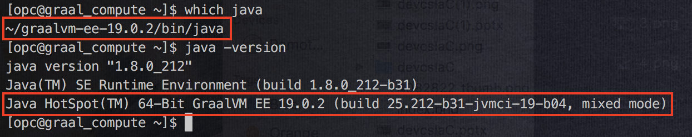

## Introduction

This is the first of several labs that are part of the **GraalVm on Oracle Cloud Infrastructure Workshop** This workshop will walk you through how to improve polyglot application performance using GraalVm within an OCI Compute instance.

**_To log issues_**, click here to go to the [github oracle](https://github.com/oracle/learning-library/issues/new) repository issue submission form.

## Objectives

- Get Started With Oracle Cloud Infrastructure
- Create VCN, compartment and compute instance.
- Install GraalVM on compute instance

## Getting Started

### **STEP 1**: Acquire an Oracle Cloud Trial or Workshop Account

- Wait until you receive the following email before proceeding to the next steps in the lab. Please make note of your temporary password in this email.

    

### **STEP 2**: Login to your Oracle Cloud Account

- From any browser, go to the URL:
    `https://cloud.oracle.com`

- click **Sign In** in the upper right hand corner of the browser

    


- Enter your identity domain and click **Next**

    **NOTE:** The **Identity Domain** should come from your Trial confirmation email.

    

- Once your Identity Domain is set, enter your User Name and the Password you set after your confirmation e-mail and click **Sign In**

    

- You will be presented with a Dashboard displaying the various cloud services available to this account.

    

### **STEP 3**: Create Compartment

- Click on the hamburger menu on the top left and then scroll to **Identity** and then click **Compartments** .

    

- Click on create compartment

    

- Fill out the details Name, description and then click **Create Compartment**

    

### **STEP 4a**: Create SSH-Keys (Mac/Linux)

- In a `Linux/Mac` client terminal window **Type** the following

  - **type**  mkdir keys

  - **type** cd keys

- Now **Type** the following to generate the OCI Instance key pair (**For this lab we WON'T be using Passphrases**):

  ```
  ssh-keygen -b 2048 -t rsa -f oci_instance_key
  ```

### **STEP 4b**: Create SSH-Keys (Windows)

- If using Windows and your OS does not have the OpenSSH bundle (comes in later versions of Windows 10. `You can open up a Command Prompt and type **ssh** or **ssh-keygen** to see`), download and install from here: [OpenSSH for Windows](http://www.mls-software.com/opensshd.html).

- In a `Windows` client terminal window **Type** the following (**For this lab we WON'T be using Passphrases**)

  - **type**  mkdir keys

  - **type** cd keys

- Now **Type** the following to generate the OCI Instance key pair:

    ```
    ssh-keygen -b 2048 -t rsa -f oci_instance_key
    ```

### **STEP 5**: Create OCI Instance and VCN

- Back on the Oracle Cloud Infrastructure compartments page select the hamburger icon in the top left of the screen. In the menu on the left of the page select **Compute**.

    

- Ensure that the compartment you just created is selected, then click **Create Instance**.

    

- Name the instance ```graal_compute```. Leave the remaining values in the photo as default and scroll down.

    

- In the **Add SSH key** section choose the oci_instance_key.pub that you created in the last step by selecting **Choose File**. You can also open the key in a text editor and paste it in if you prefer.

    

- To support networking within the instance you will also provision a Virtual Cloud Network. Give the name ```graal_vcn``` and select create.

    

- You will see that your instance is now provisioning and can proceed to the next step.

    

### **STEP 6**: Test SSH, Download and Install Graal

- Once your instance is provisioned the box will turn green and you will be provided with a public IP address. Copy the public IP and proceed.

    

- Back in your terminal, within the same folder you created your keys, type the following

    - Type ```ssh -i oci_instance_key opc@<YOUR_PUBLIC_IP>``` (pasting the public IP you just copied for **<YOUR_PUBLIC_IP>**)
    - Ensure the connection was successful.
    - Type ```exit```

    

- Now download the graalVM linux edition from this link, https://www.oracle.com/technetwork/graalvm/downloads/index.html

    

- View the zipped file in a file system viewer like Finder, right-click the file and select **Copy**.

    

- Once more in your terminal, within the keys file, type the following command making the proper substitutions between the ```<>'s```.

    - ```scp -i oci_instance_key <PASTE_HERE> opc@<YOUR_PUBLIC_IP>:```

    

- Now SSH back into the instance and unzip the file you just copied in with the following commands.

    - Login with: ```ssh -i oci_instance_key opc@<YOUR_PUBLIC_IP>```
    - Then Unzip Graal: ```tar -xzf graalvm-ee-linux-amd64-19.0.2.tar.gz```

- Use the following commands to tell your instance to use Graal in place of the native JVM.

    - ```GRAALVM_VERSION=ee-19.0.2```
    - ```export GRAALVM_HOME=graalvm-$GRAALVM_VERSION```
    - ```export JAVA_HOME=$GRAALVM_HOME```
    - ```export PATH=$GRAALVM_HOME/bin:$PATH```
    - ```source ~/.bashrc```

- Now ensure that your changes have taken effect and you can begin working with GraalVM in your instance with the following commands.

    - ```which java```
    - ```java -version```

    
